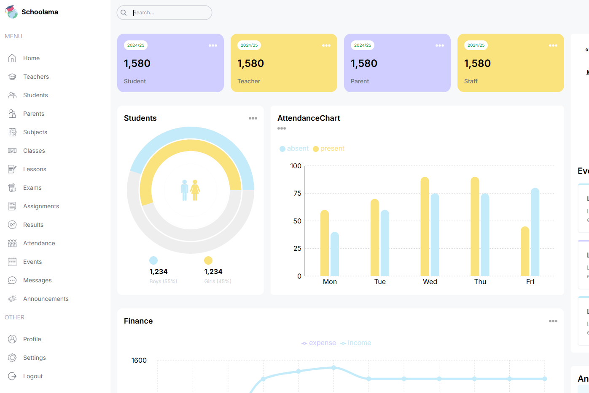

# School Management Dashboard



## About

View [here](https://education-dashboard-six.vercel.app/admin): to see the site live


This is a mockup of an education Software as a Service application. Users will be able to log in to see school data, class timetables, attendance records, etc.  There are a variety of roles: admin, teacher, parent and student, where each will have a restricted view of the site.  

## Getting Started

First, run the development server:

```bash
npm run dev
# or
yarn dev
# or
pnpm dev
# or
bun dev
```

Open [http://localhost:3000](http://localhost:3000) with your browser to see the page

## Coding Skills

This is coded using Next,js, component reuse, and css styling using Tailwind.  Components are reused throughout the app, responsive design is brought in, and lazy loading implemented to show forms on the student and teacher admin pages.  I've purposely started using TypeScript to catch errors during development.

There is limited functionality, but the idea is to extend this into a full application bringing in auth middleware, signup and data retrieval. The site probably needs a review with accessiblity and semantic HTML.
